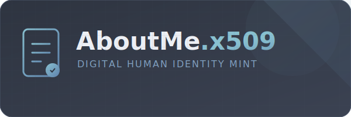

# AboutMe.x509

<p align="center">
  
</p>

> **"Your identity, cryptographically signed and universally verifiable."**

[](https://github.com/kanywst/AboutMe.x509/actions)
[](https://opensource.org/licenses/MIT)
[](https://www.rust-lang.org/)

```text
 __________________________________________
|                                          |
|            AboutMe.x509 Cert             |
|__________________________________________|
|                                          |
|  NAME: [ kanywst                      ]  |
|  ROLE: [ Developer          ].           |
|  SIGN: [ Ed25519 (Secure 2026)        ]  |
|__________________________________________|
```

## The Concept

Why just *say* who you are when you can **prove** it? `AboutMe.x509` bridges the gap between technical security and human social identity. It mints your "About Me" profile directly into a standard X.509 certificate—the same technology that secures the entire web.

- **Immutable Bio**: Once signed, your profile cannot be altered without breaking the seal.
- **Zero-Trust Intro**: Hand over your `cert.pem` instead of a business card.
- **2026 Ready**: Powered by Ed25519 for maximum security with minimal footprint.

---

## Getting Started

### 1. Mint Your Identity (Interactive)

The most exciting way to build your persona. Just run the tool and follow the prompts.

```bash
cargo run
```

### 2. Express Minting (CLI)

For the power users who know exactly who they are.

```bash
cargo run -- --name "kanywst" --hobby "Building the Future" --motto "Rust or Bust."
```

---

## Features

- **Interactive Wizard**: A beautiful, colorful CLI experience via `dialoguer`.
- **Hardened Crypto**: Uses the latest Ed25519 signatures by default.
- **Flexible Identity**: Every field except `Name` is optional—share only what you want.
- **Standard Compliant**: Output is valid X.509, readable by any system (OpenSSL, Browsers, etc.).

---

## How to View Your Soul

After minting, inspect your digital persona using the industry standard:

```bash
openssl x509 -in cert.pem -text -noout
```

Look for the `Subject` and `OU` fields—that's where your digital identity lives.

---

## For Developers

This project is built for the **2024/2026 Rust ecosystem**. We use `just` to orchestrate our workflows.

|     Command     |                 Action                  |
| :-------------: | :-------------------------------------: |
|   `just fmt`    |    Polishes your code to perfection     |
|   `just lint`   |      Enforces 2026 best practices       |
|   `just test`   | Ensures identity generation is flawless |
| `just coverage` |  Visualizes the 100% logic reliability  |

---

## License

Distributed under the **MIT License**.
